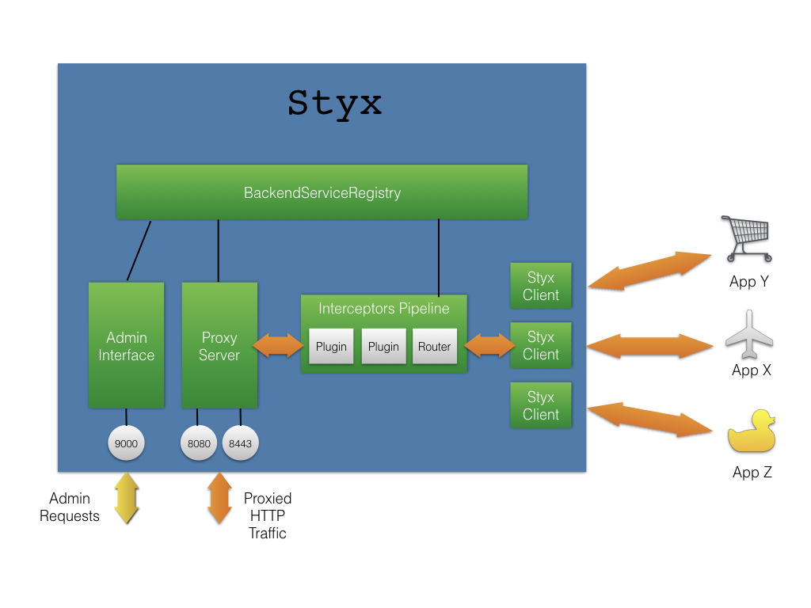

# 1. INTRODUCTION

This document is for people who want to contribute or modify the
Styx core itself, as opposed to extending it via 3rd party SPI
interface. See the [Developer Guide](./docs/developer-guide.md)
for information about extending Styx.

# 2. ARCHITECTURE AND INTERNALS

## 2.1 Project Structure

Styx has a modular architecture, consisting of the following Maven sub-projects:

Styx-Components:

 - Styx-Api
 - Styx-Client
 - Styx-Common
 - Styx-Proxy
 - Styx-Server

Styx-Support:

 - Styx-Api-Testsupport
 - Styx-origins-starter
 - Styx-Test-Api
 - Styx-testsupport

System Tests:
 - Styx-e2e-suite
 - Styx-e2e-testsupport
 - Styx-test-plugin

## OMG why so many modules?

### Styx-Components

The Styx as an application has a modular structure by design. The **styx-api**
module forms the basis for extensions like plugins and other SPI modules. This is
what a 3rd party plugin project would depend on. A plugin might need a client to
make HTTP calls to remote services. These calls must be made asynchronously.
The **styx-client** module provides couple of asynchronous clients for this
purpose. Styx application itself uses a client from the **styx-client** module.

The Styx reverse proxy server is an application that is implemented by the **styx-proxy**
module. Back in the days it seemed a good idea to separate generic HTTP server code
into a separate **Styx-Server** module, so that it could be used as a foundation
to build other server applications on top of Styx HTTP APIs.

So what about **styx-common**? All of **styx-client**, **styx-server** and
**styx-proxy** have some use for sharing common classes. This kind of classes
are not part of the 3rd party extension API (**styx-api**) and therefore
they are kept in their own **styx-common** module. This helps to keep the 3rd party
extension API as small and lean (and therefore stable) as possible.

### Styx-Support

**styx-test-api** - A test API for Styx plugin and extension developers.
Allows a Styx server to be started in desired configurations for testing
extensions. This API is intended for external consumption and therefore
should be stable, with an emphasis on ensuring backwards compatibility.

**Styx-api-testsupport** - Test helper classes for testing styx components.
It depends on **styx-api** so the test helpers have the full Styx API at
their disposal.

**styx-testsupport** - Provides generic test support classes which don't
depend on Styx definitions. Therefore **styx-api** itself can use these
definitions.

**styx-origins-starter** - A simple app for starting stub origins for
testing purposes.

### System Tests

**styx-e2e-suite** - A suite of end-to-end tests for Styx written in Scala.
These tests start and stop styx server programmatically and execute tests
only via Styx's external interfaces.

**styx-test-plugin** - An example plugin implementation that is also
used in some end-to-end tests.

**styx-e2e-testsupport** - A support module for Styx end-to-end tests. This
module depends on all Styx core packages.

## 2.2 Styx Architecture

Styx proxies all requests/responses in a streaming fashion. The proxying starts
immediately when the HTTP request headers are received, and the additional content
chunks are proxied as soon as they arrive. This is to reduce response latency and
memory footprint that would have been exaggerated if the HTTP message was
buffered prior to proxying. However there is nothing to prevent Styx interceptor
plugins from buffering requests. Indeed in some applications buffering is
unavoidable.

Styx also applies flow control for large HTTP messages. The flow control prevents
the JVM from exhausting its memory when the other side of the proxy is significantly
faster or slower than the other side. The consumer originating the HTTP request
is often behind a slower network than the backend services which are typically
on the same high-speed LAN segment as Styx.

Styx applies flow control to large HTTP requests, such as file downloads, by slowing
down the TCP connection on the faster side to match the one on the slower side. This
reduces the need for Styx to buffer the incoming messages and therefore conserves memory.

### 2.2.1 Overall structure

 

- Backend Services Registry - Manages configured backend services. Currently,
  Styx only implements a file backed back-end service registry. However this is behind
  an SPI (Service Provider Interface) interface and therefore can be extended
  to use Consul, and other providers.

- Styx Proxy Server - Implements the proxying functionality.

- Interceptors Pipeline - Aleady discussed elsewhere.

- Styx Client - Sends requests to *back-end services* and will be discussed more in detail.

- Styx Admin Interface - The admin interface is built on *Styx-Server*, but instead
  of proxying traffic, it serves admin endpoints.

### 2.2.2 Backend Services Registry

Knows about configured backend services. It propagates messages about
added/removed/changed applications to the other components, such as admin interface,
proxy server, and so forth.

### 2.2.3 Styx Proxy Server

Is built on top of *Styx-Server* module, which in turn is built on Netty.
It opens a browser-facing server port (HTTP, HTTPS, or both) for incoming
HTTP messages.

The Netty pipeline for Styx proxy server collects channel (or TCP connection)
metrics, prunes idle channels, encrypts/decrypts traffic with SSL/TLS codec,
and most importantly encodes and decodes HTTP messages to Styx representations.

The received traffic is passed on to the Styx interceptors pipeline for further
processing.

### 2.2.4 Interceptors Pipeline

Hosts the Styx extension plugins, sandwiched between some Styx internal interceptors.
At the end of the pipeline there is a backend services router that determines the backend
service as per the best matching URL path prefix. The pipeline layout is illustrated in
the diagram below. However we have plans to introduce more flexible configuration as
described in the Roadmap section.

       Proxy Server

       REQ    RESP
        |      ^
        |      |
        v      |
    +----------------+
    |                |
    |   Internal     |
    | Interceptors   |
    |    |    ^      |
    |    |    |      |
    |    v    |      |
    |   Extension    |
    |    Plugins     |
    |    |    ^      |
    |    |    |      |
    |    v    |      |
    |   Internal     |
    | Interceptors   |
    |    |    ^      |
    |    |    |      |
    |    v    |      |
    | Backend Serv.  |
    |    Router      |
    |    |    |      |
    +----------------+
         |    ^
         |    |
         v    |
      Backend Services
         Client

It is the Backend Services Registry that keeps the BackendServicesRouter (and other parties like the
admin interface) up-to-date about the latest backend service configuration. Although Styx currently
supports static file based configurations only, this architecture allows runtime backend configuration
changes. The BackendServiceRouter is able to adapt to such changes.

The BackendServiceRouter creates a separate Styx HTTP client instance for each backend service. For
this reason it is sometimes referred to a *Backend Services Client*.

### 2.2.5 Styx HTTP Client

Styx Client is an asynchronous non-blocking HTTP client, that talks to the configured
 backend services (as opposed to individual servers). For the backend service:

 - It load balances between the individual servers. A couple of load balancing algorithms
   have been implemented, and new ones can be implemented by and plugged in via the SPI
   interface.

 - A pool of TCP connections is maintained for each origin.

 - Health checks the individual origins (see Origin States below), and takes the unhealthy
   origins out of rotation, and adds healthy origins into the rotation.

 - OriginsInventory component knows about the origins and their states, and keeps the
   Load Balancer up-to-date regarding origins.

 - Retry-Handling takes care of re-sending the response when errors occur. The retry handling
   behaves as per configured retry policy. The retry policy logic can also be extended via
   service provider interface.

 - Supports sticky sessions. This allows pinning sessions to an individual origin.

 - Supports HTTPS.

The client is built on Netty and Rx.Java. The client uses Netty for asynchronous networking
and HTTP(s) framing. The Netty channel pipeline transforms between Styx and Netty HTTP messages.
Received HttpResponse objects (including the streaming content) are published as Rx.Java
observable events to the Styx proxy server.

# 3. Roadmap

## 3.1 Routing/AntlrDSL for querying requests

   - The styx interceptor pipeline is fixed in the sense that it can only have a backend-service
     router at the end of the chain of pluggable interceptors.

   - We will allow nested pipelines, with different routing behaviour.

   - ANTLR DSL will allow us to inspect HTTP request properties, and make configurable
     routing decisions based on that.

## 3.2 Styx 2.0 HTTP Message API

   - Observables can be confusing, and are prone to misuse.

   - Rx.Java observables are a general purpose framework for manipulating streaming
     events. However, Styx has a very specific use case for streaming HTTP traffic.

   - Due to this specific use case, not all observable operations are allowed, or even
     make sense. Some observable operations can cause undesirable side effects in the context
     of Styx, such as duplicating HTTP requests, and so forth.

   - Rx.Observables offers a large API, and the developers can easily get lost in it.
     In our experience it will then cause unintentional misuse of the API.

   - Styx interceptors only ever need two RX operators to support HTTP message transformations
     in asynchronous way:

       1. *map()* - to transform message synchronously
       2. *flatMap()* - to transform message asynchronously

   - The new API will remove the observables from the Styx HttpInterceptor and HttpMessage
     (also request/response) interfaces.

   - An important benefit is that the boundary between the Styx core and third-party plugins becomes
     clearer.

## 3.3 Executor/threading model for plugins

   - Currently each plugin has to implement its own threading model.
   - Expose an event loop to the plugin that processes events in a non-blocking fashion.
   - Enables plugins to perform asynchronous background tasks.

