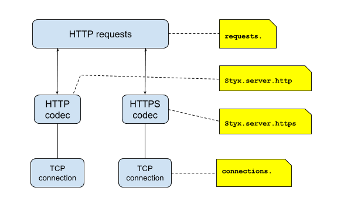
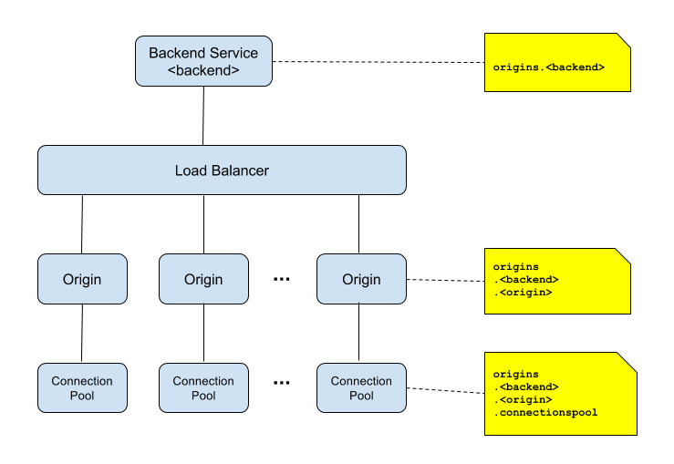

# Metrics

Styx collects metrics to provide insight into its operational status. They
can be viewed via admin interface at `http://<styx-host>/admin/metrics`.
They can also be exported into a Graphite monitoring backend. Support for
other monitoring back-ends can be implemented via service point interface.

## Viewing Specific Metrics via the Admin Interface

In addition to viewing the entire set of metrics, it is also possible to request specific metrics like this:

`http://<styx-host>/admin/metrics/<metric-name>`

This will return the metric that matches the specified name (if it exists) as well as any metrics
that use the specified name as a prefix.

For example `http://<styx-host>/admin/metrics/requests.response` would return

    requests.response.sent
    requests.response.status.1xx
    requests.response.status.2xx
    ...
    
## Searching Metrics for string

Use a `filter` query parameter to filter for metrics names matching a given string. 
For example `filter=count` only shows metrics whose name contains `count`. The filtering is applied to the results of the metrics query.

Examples where `term` is the string you want to filter for:

`http://<styx-host>/admin/metrics?filter=<term>`

`http://<styx-host>/admin/metrics/<metric-name>?filter=<term>`

    
## Metrics Grouping

Styx metrics are roughly grouped into *server* and *client* metrics.
The server metrics are measured at the server port where the HTTP traffic
comes in. The client metrics are measured on the application side where
the requests are forwarded to the backend services.

### Server Side Metrics

 - HTTP level metrics (`requests` scope)

```
    requests.cancelled.<cause>x
    requests.outstanding
    requests.response.sent
    requests.response.status.1xx
    requests.response.status.2xx
    requests.response.status.3xx
    requests.response.status.4xx
    requests.response.status.5xx
    requests.response.status.<code|when code >= 400>
    requests.response.status.unrecognised

    requests.received
    requests.error-rate.500
    requests.latency
```

 - TCP connection level metrics (`connections` scope)

```
    connections.eventloop.<thread>.registered-channel-count
    connections.total-connections
    connections.eventloop.<thread>.channels -histogram
    connections.bytes-received
    connections.bytes-sent
```

Following metrics are only available when `OPENSSL` provider is used:

```
    connections.openssl.session.accept
    connections.openssl.session.acceptGood
    connections.openssl.session.acceptRenegotiate
    connections.openssl.session.cacheFull
    connections.openssl.session.cbHits
    connections.openssl.session.misses
    connections.openssl.session.number
    connections.openssl.session.timeouts
```

 - Server metrics (`styx` scope)

```
    styx.exception.<cause>
    styx.server.http.requests
    styx.server.http.responses.<code>
    styx.server.https.requests
    styx.server.https.responses.<code>
    styx.version.buildnumber
```

The server side metrics scopes are illustrated in a diagram below:



### Client Side Metrics

 - Request metrics aggregated to back-end service

```
    origins.<backend>.requests.cancelled
    origins.<backend>.requests.success-rate
    origins.<backend>.requests.error-rate
    origins.<backend>.requests.response.status.<code>
    origins.<backend>.requests.response.status.5xx
    origins.<backend>.requests.response.status.-1
    origins.<backend>.requests.latency
```

 - Request metrics per origin origin

```
    origins.<backend>.<origin>.requests.cancelled
    origins.<backend>.<origin>.requests.success-rate
    origins.<backend>.<origin>.requests.error-rate
    origins.<backend>.<origin>.requests.response.status.<code>
    origins.<backend>.<origin>.requests.response.status.5xx
    origins.<backend>.<origin>.requests.response.status.-1
    origins.<backend>.<origin>.requests.latency
```

 - Connection pool metrics

```
    origins.<backend>.<origin>.connectionspool.available-connections
    origins.<backend>.<origin>.connectionspool.busy-connections
    origins.<backend>.<origin>.connectionspool.connection-attempts
    origins.<backend>.<origin>.connectionspool.connection-failures
    origins.<backend>.<origin>.connectionspool.connections-closed
    origins.<backend>.<origin>.connectionspool.connections-terminated
    origins.<backend>.<origin>.connectionspool.pending-connections
    origins.<backend>.<origin>.status
```

The client side metrics scopes are illustrated in a diagram below:




### JVM Metrics

Styx also measures metrics from the underlying JVM:

    jvm.bufferpool.direct.capacity
    jvm.bufferpool.direct.count
    jvm.bufferpool.direct.used
    jvm.bufferpool.mapped.capacity
    jvm.bufferpool.mapped.count
    jvm.bufferpool.mapped.used
    jvm.gc.PS-MarkSweep.count
    jvm.gc.PS-MarkSweep.time
    jvm.gc.PS-Scavenge.count
    jvm.gc.PS-Scavenge.time
    jvm.memory.heap.committed
    jvm.memory.heap.init
    jvm.memory.heap.max
    jvm.memory.heap.usage
    jvm.memory.heap.used
    jvm.memory.non-heap.committed
    jvm.memory.non-heap.init
    jvm.memory.non-heap.max
    jvm.memory.non-heap.usage
    jvm.memory.non-heap.used
    jvm.memory.pools.Code-Cache.committed
    jvm.memory.pools.Code-Cache.init
    jvm.memory.pools.Code-Cache.max
    jvm.memory.pools.Code-Cache.usage
    jvm.memory.pools.Code-Cache.used
    jvm.memory.pools.Compressed-Class-Space.committed
    jvm.memory.pools.Compressed-Class-Space.init
    jvm.memory.pools.Compressed-Class-Space.max
    jvm.memory.pools.Compressed-Class-Space.usage
    jvm.memory.pools.Compressed-Class-Space.used
    jvm.memory.pools.Metaspace.committed
    jvm.memory.pools.Metaspace.init
    jvm.memory.pools.Metaspace.max
    jvm.memory.pools.Metaspace.usage
    jvm.memory.pools.Metaspace.used
    jvm.memory.pools.PS-Eden-Space.committed
    jvm.memory.pools.PS-Eden-Space.init
    jvm.memory.pools.PS-Eden-Space.max
    jvm.memory.pools.PS-Eden-Space.usage
    jvm.memory.pools.PS-Eden-Space.used
    jvm.memory.pools.PS-Old-Gen.committed
    jvm.memory.pools.PS-Old-Gen.init
    jvm.memory.pools.PS-Old-Gen.max
    jvm.memory.pools.PS-Old-Gen.usage
    jvm.memory.pools.PS-Old-Gen.used
    jvm.memory.pools.PS-Survivor-Space.committed
    jvm.memory.pools.PS-Survivor-Space.init
    jvm.memory.pools.PS-Survivor-Space.max
    jvm.memory.pools.PS-Survivor-Space.usage
    jvm.memory.pools.PS-Survivor-Space.used
    jvm.memory.total.committed    
    jvm.memory.total.init
    jvm.memory.total.max
    jvm.memory.total.used
    jvm.thread.blocked.count
    jvm.thread.count
    jvm.thread.daemon.count
    jvm.thread.deadlock.count
    jvm.thread.deadlocks
    jvm.thread.new.count
    jvm.thread.runnable.count
    jvm.thread.terminated.count
    jvm.thread.timed_waiting.count
    jvm.thread.waiting.count
    jvm.uptime
    jvm.uptime.formatted


### Undocumented or unstable metrics


Following metrics are subject to change their names:

     origins.healthcheck.failure.<app>
     origins.healthcheck.failure.<app>.<instance>
     origins.response.status.<code>


### Plugin Metrics

Custom extension plugins expose their metrics under `styx.plugins.<name>`
hierarchy. The `name` is a plugin name as it is configured in the
`plugins` section. Consider the following:

```
  plugins:
  all:
    guidFixer:
      factory:
        ... factories ...
      config:
        ... config ...
```

All metrics from this plugin would go under `styx.plugins.guidFixer` prefix.


# Metrics Reporter Configuration

## Graphite Reporter

To enable metrics reporting to Graphite backend, add `graphite` as a
service name in the `services.factories` configuration block.

Here is an example configuration:

    services:
      factories:
        graphite:
          class: "com.hotels.styx.metrics.reporting.graphite.GraphiteReporterServiceFactory"
          config:
            prefix: "styx-lab-02"
            host: "some-ip"
            port: 2003
            intervalMillis: 15000

* `class` - Set to `com.hotels.styx.metrics.reporting.graphite.GraphiteReporterServiceFactory`
  to enable reporting to Graphite backend in particular.

* `config`

  * `prefix` - A prefix string that is prepended to metric names.
    Allows you to identify the particular styx instance when several styx
    instances are reporting to the same Graphite backend.

  * `host` - Graphite server host name.

  * `port` - Graphite server port.

  * `intervalMillis` - A metrics reporting interval, in milliseconds.


# Styx Metrics Reference

A [Styx Metrics Reference](./metrics-reference.md) has a detailed description for each metric.
