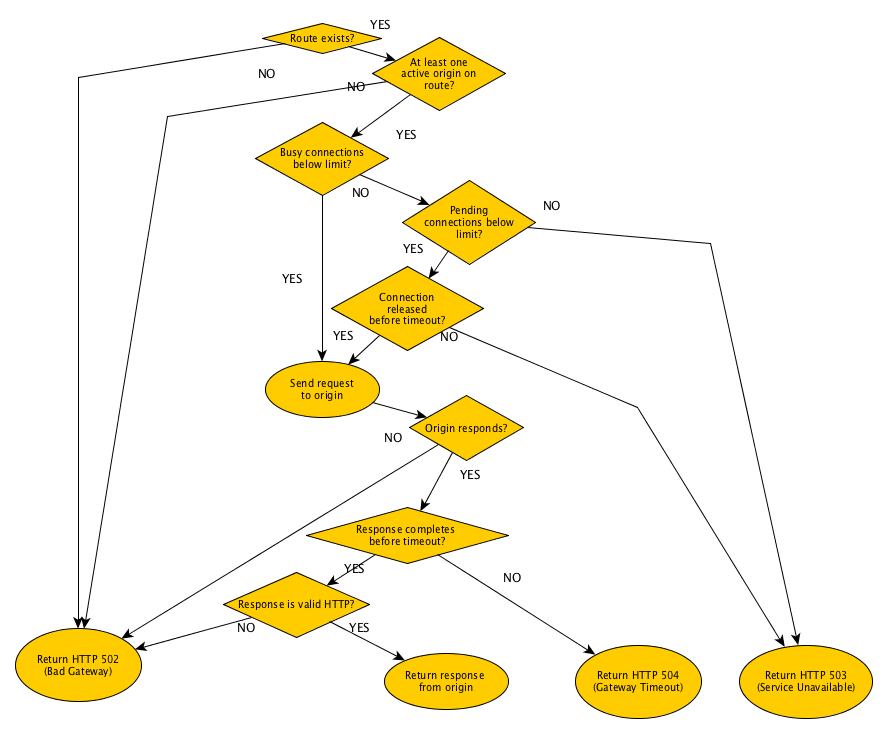

# Styx Server Error (5xx) Response Codes

Styx responds with specific error codes when things don't go according to plan.
This refers only to responses generated by Styx itself, not responses being proxied from downstream.
For a general explanation of 5xx (Server Error) codes, please see the HTTP Spec.
 
Note that interceptor plugins can also be programmed to modify response codes, so 
they may introduce 5xx statuses for other reasons not listed here.
 
Here is a summary of those codes:

## 502 Bad Gateway

* No route configured to backend service. An unexpected path prefix is received,
  and no default backend has been configured. A default backend is one associated
  with the "/" (root path) prefix. 

* There are no origin servers available for the backend service. For example,
  all the origins for that service are marked as inactive.

* Styx is unable to establish a TCP connection to an origin.

* An invalid HTTP response is received from the backend origin server.

* Origin does an *abortive TCP connection release* by setting the *RST*
  bit on the TCP response segment.

## 503 Service Unavailable

* The connection pool for the origin is full. That is, the maximum number of both busy connections 
 and pending (waiting) connections has been reached.
  
* The connection pool for the origin is full and the connection has been pending 
  (waiting) for the maximum amount of time allowed by `pendingConnectionTimeoutMillis`.
  

## 504 Gateway Timeout
 
* Styx has been waiting for a backend service origin to send data, but has not received anything 
  for `responseTimeout` milliseconds.