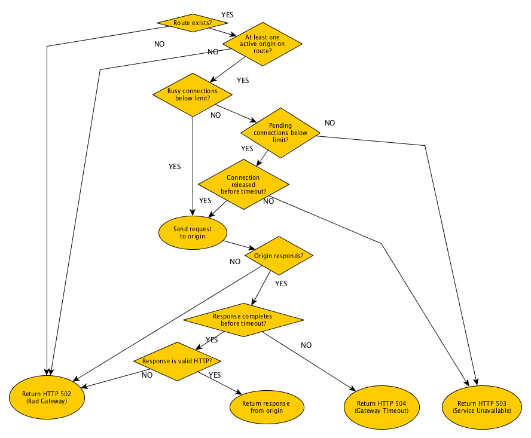

# Styx Response Codes

tyx responds with an HTTP error status code if it is unable to proxy a request. These responses are generated 
by Styx itself, not proxied from downstream.
This section describes those responses and the specific conditions in which they are sent.
Note that interceptor plugins can also be programmed to modify response codes, so they may introduce 4xx or 
5xx statuses for other reasons not listed here.

## Client Errors (4xx codes)

Styx responds with specific HTTP error codes when the client's behaviour is unexpected or does not conform 
to HTTP protocol.
For a general explanation of 4xx (Server Error) codes, please see the HTTP Spec.

### 400 Bad Request

Occurs when the HTTP request format does not conform to HTTP 1.1 protocol specification, for example when 
there is an unrecognised HTTP verb or multiple `Host` headers.

### 408 Request Timeout

Styx responds with 408 Request Timeout error when the underlying TCP connection has been inactive for longer 
than a configurable threshold while receiving an HTTP request.

When a remote client is sending an HTTP Request, it must demonstrate its presence by continuously sending bytes 
over the network. If the client stops sending the request part way through, or slows down too much, Styx will 
observe a period of inactivity on the underlying TCP connection and reject the request with a 408 Request Timeout.

The `proxy.requestTimeoutMillis` server configuration parameter controls the amount of inactivity is tolerated.

The timer only applies while the HTTP request is being transmitted "over the wire". The timer is stopped when the 
request is fully received, so any delay or inactivity introduced by the origins will not trigger this timeout.

## Server Errors (5xx codes)

Styx responds with specific error codes when an attempt to serve a request fails due to a failure in the
proxying action.
For a general explanation of 5xx (Server Error) codes, please see the HTTP Spec.
 
Here is a summary of those codes:

### 502 Bad Gateway

* No route configured to backend service. An unexpected path prefix is received,
  and no default backend has been configured. A default backend is one associated
  with the "/" (root path) prefix. 

* There are no origin servers available for the backend service. For example,
  all the origins for that service are marked as inactive.

* Styx is unable to establish a TCP connection to an origin.

* An invalid HTTP response is received from the backend origin server.

* Origin does an *abortive TCP connection release* by setting the *RST*
  bit on the TCP response segment.

### 503 Service Unavailable

* The connection pool for the origin is full. That is, the maximum number of both busy connections 
 and pending (waiting) connections has been reached.
  
* The connection pool for the origin is full and the connection has been pending 
  (waiting) for the maximum amount of time allowed by `pendingConnectionTimeoutMillis`.
  

### 504 Gateway Timeout
 
* Styx has been waiting for a backend service origin to send data, but has not received anything 
  for `responseTimeout` milliseconds.
